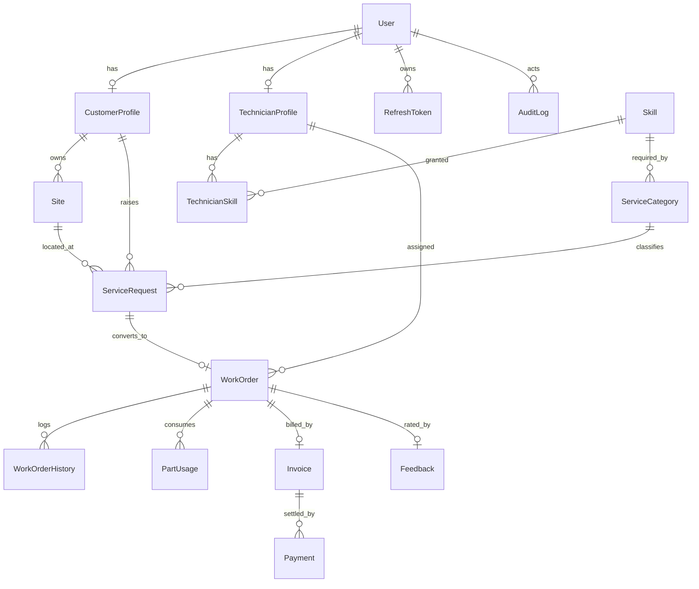

# FieldOps — Field Service Management API

Backend for an on-site technical service business: calibration, repair, installation and preventive
maintenance of industrial instruments (flow meters, pressure transmitters, gas detectors, panels).

A customer raises a service request against one of their sites → a dispatcher approves it and assigns a
skill-matched technician into a conflict-free time slot → the technician runs the job through a guarded
status workflow and logs the parts used → the system generates an invoice from the hours actually worked
→ the customer pays through Stripe → the payment is confirmed by a signature-verified webhook.

**B7A6 Assignment 7 — Field Service Management** (student ID last digit `7`).

---

## Submission

| | |
|---|---|
| **Live API** | `https://<your-project>.vercel.app/api/v1` |
| **API docs** | `docs/FieldOps.postman_collection.json` (import into Postman) |
| **Demo video** | *(link)* |
| **Demo admin** | `admin@gmail.com` / `Admin@12345` |
| **Demo customer** | `corp1@apextextiles.com` / `Admin@12345` |
| **Demo technician** | `tech.rahim@gmail.com` / `Admin@12345` |

---

## Stack

| Concern | Choice |
|---|---|
| Runtime | Node.js + TypeScript + Express 5 |
| Database | PostgreSQL (Neon, pooled connection) |
| ORM | Prisma 7 with the `@prisma/adapter-pg` driver adapter |
| Validation | Zod 4, applied by a `validateRequest` middleware |
| Auth | JWT access + refresh (rotating, hashed, revocable) · Google Identity Services |
| Payments | Stripe Checkout + signature-verified webhook |
| Files | Multer (memory) + Cloudinary |
| Security | helmet · cors · express-rate-limit · bcrypt |
| Deploy | Vercel serverless |

---

## Architecture

Every module follows the same path, and no layer reaches past its neighbour:

```
route  →  middleware (auth, validateRequest)
       →  controller  (thin: reads req, calls service, sends response)
       →  service     (all business logic + transactions)
       →  prisma
```

```
src/
  app.ts                     express instance, middleware order, Stripe raw-body mount
  server.ts                  local bootstrap (connect → seed → listen)
  seed.ts                    standalone seed runner for production
  generated/prisma/          Prisma client output (gitignored)
  app/
    config/index.ts          Zod-validated environment
    interfaces/index.ts      IQuery, IMeta
    lib/                     prisma · stripe · cloudinary · googleAuth
    middleware/              checkAuth · validateRequest · globalErrorHandler · notFound
                             · rateLimiter · upload
    utils/                   AppError · catchAsync · sendResponse · jwt · paginate · pick
                             · codeGenerator · auditLogger · seed
    module/<name>/           <name>.route.ts | .controller.ts | .service.ts
                             | .validation.ts | .interface.ts | .constant.ts
    routes/index.ts          route registry mounted at /api/v1
api/index.ts                 Vercel serverless entry
```

### Conventions

- Every response leaves through `sendResponse`; nothing calls `res.json()` directly.
- Every failure travels through `catchAsync` → `globalErrorHandler`; controllers contain no try/catch.
- Every list query filters `deletedAt: null` **in the service**, never in the controller.
- Deletes are soft. `prisma.delete` appears nowhere in the codebase.
- Passwords are removed at the query with Prisma's `omit`, so they cannot leak by accident.
- Role scoping lives in the service, so one route can serve several audiences safely.

---

## Data model

16 models. `String @id @default(uuid())` throughout, `@@map` to snake_case tables, indexes matched to the
real query patterns.



### State machines

```
ServiceRequest:  PENDING ──► APPROVED ──► CONVERTED
                    ├──► REJECTED
                    └──► CANCELLED            (customer, only while PENDING)

WorkOrder:  ASSIGNED ──► SCHEDULED ──► EN_ROUTE ──► IN_PROGRESS ──► COMPLETED ──► INVOICED ──► PAID
                 └────────────┴────────────┴─────────────┴──► CANCELLED   (admin only, with reason)
```

Transitions are not a free-form `PATCH status`. `workOrder.constant.ts` holds the allowed map plus the
role permitted to drive each one, and the service checks three gates: is the transition legal, is this
role allowed, and — for a technician — is this actually their job. `PAID` has an empty role list: only
the Stripe webhook reaches it.

---

## Roles

| Role | Can do |
|---|---|
| `CUSTOMER` | Register, manage profile and sites, create / edit / cancel own requests, view own work orders and invoices, pay, leave feedback |
| `TECHNICIAN` | View **only** assigned work orders, drive EN_ROUTE → IN_PROGRESS → COMPLETED, log parts |
| `ADMIN` | Approve / reject requests, assign and reschedule technicians, manage the catalog, suspend / reactivate accounts, change roles, view everything |

`auth(...roles)` answers *"is this person an admin?"*. It cannot answer *"is this **their** job?"* — that
ownership check lives in the service, where the record has been loaded. Both are enforced:

```
Technician B → Technician A's work order   403  This Job Is Not Assigned To You
Customer B  → Customer A's invoice         403  This Is Not Your Invoice
Technician  → admin-only reschedule        403  no permission
Customer    → approve a request            403  no permission
Customer    → GET /admin/users             403  no permission
```

`checkAuth` also re-reads the user from the database on every request, so a suspension, deletion or role
change takes effect immediately rather than when the 15-minute token expires.

---

## Two database-level guarantees

**Schedule conflict detection.** An application-level "is the slot free?" check has an unavoidable race:
two dispatchers both read *free*, both insert. A Postgres exclusion constraint makes the check and the
write one atomic operation:

```sql
CREATE EXTENSION IF NOT EXISTS btree_gist;

ALTER TABLE "work_orders"
ADD CONSTRAINT "no_technician_double_booking"
EXCLUDE USING gist (
  "technicianId" WITH =,
  tstzrange("scheduledStart", "scheduledEnd", '[)') WITH &&
)
WHERE ("status" IN ('ASSIGNED','SCHEDULED','EN_ROUTE','IN_PROGRESS') AND "deletedAt" IS NULL);
```

The scheduling columns are `@db.Timestamptz(3)` because `tstzrange()` requires `timestamptz` — with a
plain `timestamp` the cast is not immutable and Postgres refuses the constraint. A violation raises
SQLSTATE `23P01`, which the global error handler maps to **409 Conflict**.

**Business codes.** `SR-`, `WO-` and `INV-` numbers come from Postgres sequences rather than
`count() + 1`, so concurrent requests can never be handed the same number.

---

## Transactions

| Operation | Guarantees |
|---|---|
| Approve request → work order | `Serializable`. Skill match → daily cap → create work order → request `CONVERTED` → history → audit. |
| Complete → generate invoice | Labour from **actual** times, parts summed, VAT applied, `INV-` allocated, status → `INVOICED`. |
| Stripe webhook → settle | `Serializable` and **idempotent**: looks up by our `transactionId`, exits early if already `SUCCESS`, re-verifies the charged amount, then marks payment → invoice → work order paid. |
| Submit feedback | Insert the rating and recompute the technician's `ratingAvg` / `ratingCount` together, so the stored average can never drift from the rows behind it. |
| Suspend / change role | Update the user and revoke every live refresh token in one transaction, so access cannot outlive the decision. |

---

## Payments

Stripe Checkout in test mode. The flow is deliberately split so nothing client-side can mark an invoice
paid:

1. `POST /payments/initiate` writes a `Payment` row in `INITIATED` with our own `transactionId`, then
   creates a Checkout session carrying that id in `metadata`.
2. The customer pays on Stripe's hosted page (test card `4242 4242 4242 4242`).
3. Stripe calls `POST /payments/webhook`. The signature is verified against the **raw** request body —
   which is why that one route is mounted with `express.raw()` *before* `express.json()` in `app.ts`.
4. Only then are payment, invoice and work order marked paid, in one transaction.

Each attempt is its own `Payment` row, so an abandoned or failed checkout leaves a trail and the customer
can retry. Checkout runs in USD because Stripe does not support BDT.

Run the webhook locally with:

```bash
stripe listen --forward-to localhost:5000/api/v1/payments/webhook
```

---

## API

All routes are under `/api/v1`. Full request/response detail, including the authorization and error
demos, is in the Postman collection.

<details>
<summary><strong>Auth</strong> (6)</summary>

| Method | Path | Access |
|---|---|---|
| POST | `/auth/register` | public |
| POST | `/auth/login` | public |
| POST | `/auth/google` | public |
| POST | `/auth/refresh-token` | public (refresh cookie) |
| POST | `/auth/logout` | public |
| POST | `/auth/change-password` | any authenticated |

</details>

<details>
<summary><strong>Users & technicians</strong> (4)</summary>

| Method | Path | Access |
|---|---|---|
| GET | `/users/me` | any authenticated |
| PATCH | `/users/me` | any authenticated |
| PATCH | `/users/me/avatar` | any authenticated (multipart) |
| GET | `/technicians` | public |

</details>

<details>
<summary><strong>Catalog</strong> (7)</summary>

| Method | Path | Access |
|---|---|---|
| GET | `/categories` | public |
| GET | `/categories/:categoryId` | public |
| POST | `/categories` | ADMIN |
| PATCH | `/categories/:categoryId` | ADMIN |
| DELETE | `/categories/:categoryId` | ADMIN (soft) |
| GET | `/skills` | public |
| POST | `/skills` | ADMIN |

</details>

<details>
<summary><strong>Sites</strong> (4)</summary>

| Method | Path | Access |
|---|---|---|
| POST | `/sites` | CUSTOMER |
| GET | `/sites` | CUSTOMER (own) · ADMIN (all) |
| GET | `/sites/:siteId` | CUSTOMER (own) · ADMIN |
| PATCH | `/sites/:siteId` | CUSTOMER (own) |

</details>

<details>
<summary><strong>Service requests</strong> (8)</summary>

| Method | Path | Access |
|---|---|---|
| POST | `/requests` | CUSTOMER |
| GET | `/requests` | ADMIN (all) · CUSTOMER (own) |
| GET | `/requests/:requestId` | ADMIN · CUSTOMER (own) |
| PATCH | `/requests/:requestId` | CUSTOMER, PENDING only |
| PATCH | `/requests/:requestId/cancel` | CUSTOMER, PENDING only |
| PATCH | `/requests/:requestId/approve` | ADMIN → creates work order |
| PATCH | `/requests/:requestId/reject` | ADMIN |
| DELETE | `/requests/:requestId` | ADMIN (soft) |

`GET /requests` supports `page`, `limit`, `sortBy`, `sortOrder`, `searchTerm`, `status`, `priority`,
`categoryId`, `siteId`.

</details>

<details>
<summary><strong>Work orders</strong> (9)</summary>

| Method | Path | Access |
|---|---|---|
| GET | `/work-orders` | ADMIN · TECHNICIAN (own) · CUSTOMER (own) |
| GET | `/work-orders/my-assigned` | TECHNICIAN |
| GET | `/work-orders/:workOrderId` | ownership-checked |
| PATCH | `/work-orders/:workOrderId/status` | guarded state machine |
| PATCH | `/work-orders/:workOrderId/reschedule` | ADMIN |
| POST | `/work-orders/:workOrderId/parts` | TECHNICIAN (own job) |
| POST | `/work-orders/:workOrderId/invoice` | ADMIN |
| POST | `/work-orders/:workOrderId/feedback` | CUSTOMER, PAID only |
| GET | `/work-orders/:workOrderId/feedback` | ownership-checked |

`GET /work-orders` supports `page`, `limit`, `sortBy`, `sortOrder`, `searchTerm`, `status`,
`technicianId`, `from`, `to`.

</details>

<details>
<summary><strong>Invoices & payments</strong> (5)</summary>

| Method | Path | Access |
|---|---|---|
| GET | `/invoices` | role-scoped |
| GET | `/invoices/:invoiceId` | ownership-checked |
| POST | `/payments/initiate` | CUSTOMER · ADMIN |
| POST | `/payments/webhook` | Stripe only (signature-verified) |
| GET | `/payments/:transactionId` | ownership-checked |

</details>

<details>
<summary><strong>Admin user management</strong> (4)</summary>

| Method | Path | Access |
|---|---|---|
| GET | `/admin/users` | ADMIN — `?role&status&searchTerm&page&limit` |
| GET | `/admin/users/:userId` | ADMIN |
| PATCH | `/admin/users/:userId/status` | ADMIN — suspend / reactivate |
| PATCH | `/admin/users/:userId/role` | ADMIN |

Suspension takes effect on the account's **next request**, not when its token expires: `checkAuth`
re-reads the user every time, and the same transaction revokes every refresh token so the session cannot
be renewed. An admin cannot change their own status or role.

</details>

<details>
<summary><strong>Customer feedback</strong> (1)</summary>

| Method | Path | Access |
|---|---|---|
| GET | `/feedbacks` | role-scoped: customers see ratings they left, technicians ratings they received, admins all |

Submitting and reading a single rating hang off the work order (see above).

</details>

### Response shape

Success:

```json
{
  "success": true,
  "statusCode": 200,
  "message": "Work Orders Retrieved Successfully",
  "data": [],
  "meta": { "page": 1, "limit": 10, "total": 42, "totalPages": 5 }
}
```

Failure:

```json
{
  "success": false,
  "statusCode": 400,
  "message": "Validation Error",
  "errors": [{ "path": "email", "message": "Invalid email address" }]
}
```

`globalErrorHandler` maps Zod failures field by field, Prisma `P2002` → 409, `P2003` → 400, `P2025` → 404,
and the exclusion-constraint `23P01` → 409. Stack traces and raw messages for 5xx are returned only in
development.

---

## Running locally

```bash
git clone https://github.com/SuvraDebPaul/FieldOps-Backend.git
cd FieldOps-Backend
npm install                 # postinstall runs prisma generate
cp .env.example .env        # then fill in the values below
npx prisma migrate deploy
npm run dev
```

The local bootstrap seeds on boot: one admin, four technicians with skills, three customers with sites,
and eight service categories. Seeding is idempotent — it is skipped if the admin already exists.

| Script | Purpose |
|---|---|
| `npm run dev` | tsx watch on `src/server.ts` |
| `npm run typecheck` | `tsc --noEmit` |
| `npm run db:migrate` | `prisma migrate dev` |
| `npm run db:deploy` | `prisma migrate deploy` |
| `npm run db:seed` | seed a database that had no boot step (production) |
| `npm run db:studio` | Prisma Studio |

### Environment

| Variable | Required | Notes |
|---|---|---|
| `DATABASE_URL` | ✅ | Use the **pooled** Neon/Supabase string — a direct connection exhausts on serverless |
| `JWT_ACCESS_SECRET` | ✅ | ≥ 20 chars |
| `JWT_REFRESH_SECRET` | ✅ | different from the access secret |
| `JWT_ACCESS_EXPIRES` | | default `1d` |
| `JWT_REFRESH_EXPIRES` | | default `7d` |
| `BCRYPT_SALT_ROUNDS` | | default `10` |
| `GOOGLE_CLIENT_ID` | ✅ | must match the client id that minted the `id_token` |
| `STRIPE_SECRET_KEY` | | required to take payments |
| `STRIPE_WEBHOOK_SECRET` | | printed by `stripe listen` |
| `STRIPE_CURRENCY` | | default `usd` |
| `CLOUDINARY_CLOUD_NAME` / `_API_KEY` / `_API_SECRET` | | required for avatar upload |
| `FRONTEND_URL` | | CORS origin, default `http://localhost:3000` |
| `NODE_ENV`, `PORT` | | default `development`, `5000` |

### Google sign-in helper

There is no frontend in this repo, so `public/google-signin.html` mints an `id_token` for testing. Serve
it on an origin listed in your Google OAuth client's **Authorized JavaScript origins**:

```bash
npx serve public -l 3000
# http://localhost:3000/google-signin.html?client_id=YOUR_CLIENT_ID.apps.googleusercontent.com
```

Sign in, and the token is copied to the clipboard. POST it as `{ "idToken": "..." }` to
`/api/v1/auth/google`.

---

## Deployment (Vercel)

`api/index.ts` exports the Express app as a serverless handler — it does **not** call `listen()` and does
not seed, since that would run on every cold start.

1. Import the repository in Vercel.
2. Add every environment variable from the table above.
3. `vercel-build` runs `prisma generate && prisma migrate deploy`.
4. Seed once against production: `npm run db:seed` with the production `DATABASE_URL`.
5. Point `FRONTEND_URL` at the real frontend origin, and add the deployed webhook URL as a Stripe
   endpoint (`https://<project>.vercel.app/api/v1/payments/webhook`), using that endpoint's signing
   secret for `STRIPE_WEBHOOK_SECRET`.

---

## Testing the full chain

```
POST /auth/login                       admin, customer, technician
GET  /categories                       pick a categoryId
GET  /sites                            pick a siteId
POST /requests                         → SR-2026-000001
PATCH /requests/:id/approve            → WO-2026-000001
PATCH /work-orders/:id/status          SCHEDULED → EN_ROUTE → IN_PROGRESS
POST /work-orders/:id/parts
PATCH /work-orders/:id/status          COMPLETED
POST /work-orders/:id/invoice          → INV-2026-000001
POST /payments/initiate                → Stripe checkout URL
(pay with 4242 4242 4242 4242)         → webhook marks everything PAID
POST /work-orders/:id/feedback         → rating recomputed on the technician
```

Folder `09 Authorization & error demos` in the collection covers the 401 / 403 / 409 / 400 cases,
including double-booking the same technician and attempting an illegal state transition.
